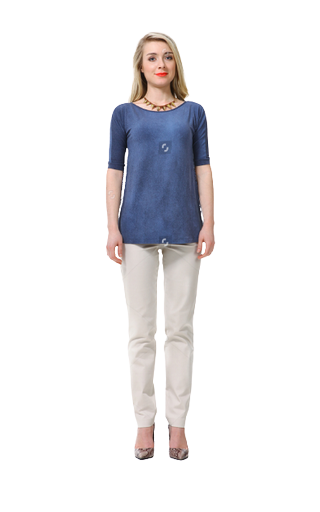

# SimuVerse 3D Virtual Try On

## Introduction
This repository contains code to take image of a person and a clothing as input and create a virtual fitting of the cloth on the person, giving a 3D model output.

Input:




Output:

![PointCloud]

## Demo
You can follow the [notebook](./notebooks/M3D_VTON_Final.ipynb) for a demo of the implementation.

## Procedure
- Install the requirements:

  ```
  pip install -r requirements.txt
  ```
- Run the setup.py script:

  ```
  python setup.py
  ```
- Create a folder called input_data with the following structure:

    __input_data__

    -->__cloth__

    ---->cloth@1=cloth_front.jpg (input)

    -->__cloth-mask__

    ---->cloth@1=cloth_front_mask.jpg (obtained by running code)

    -->__image__

    ---->person@1=person_whole_front.png (input)

    -->__image-parse__

    ---->person@1=person_whole_front_label.png (obtained by running code)

    -->__pose__

    ---->person@1=person_whole_front_keypoints.json (obtained by running code)

    -->test_pairs.txt (input)

    -->train_pairs.txt (input)
- Keep the folders with (obtained by running code) as empty.
- The test_pairs.txt and train_pairs.txt file will have the following format:
  
  `person@1=person_whole_front.png cloth@1=cloth_front.jpg`
  
- Add the [input_data](./input_data) folder in `./m3d-vton/`.

- Each image should have the following proportions:
    - width= 320
    - height= 512
    - bit depth= 24
- Run the inference.py script:
  
  ```
  python inference.py
  ```
- The results can be obtained from the `./m3d-vton/results/` directory.
