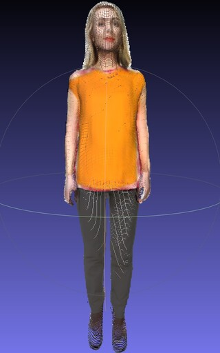
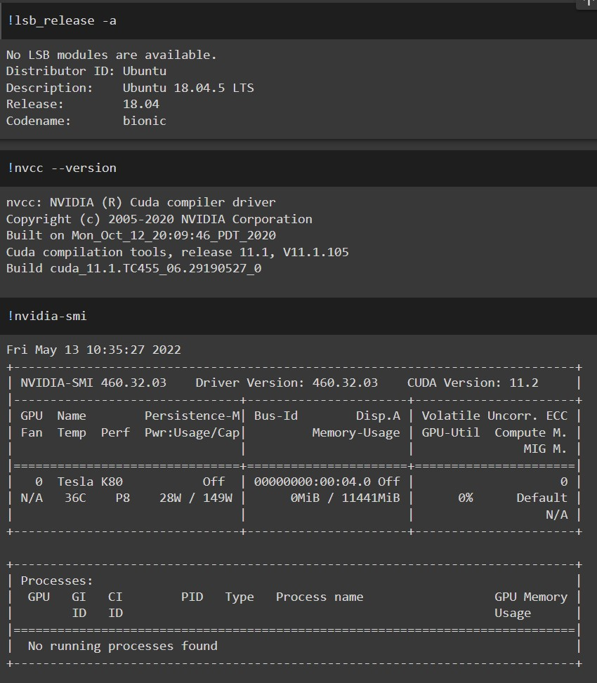

# SimuVerse 3D Virtual Try On

## Introduction
This repository contains code to take image of a person and a clothing as input and create a virtual fitting of the cloth on the person, giving a 3D model output.

Input:


Output:




## System Information


## Demo
You can follow the [notebook](./notebooks/M3D_VTON_Final.ipynb) for a demo of the implementation.

## Procedure
- Install the requirements:

  ```
  pip install -r requirements.txt
  pip install open3d
  pip install torch==1.7.1+cu110 torchvision==0.8.2+cu110 torchaudio==0.7.2 -f https://download.pytorch.org/whl/torch_stable.html
  ```
- Run the setup.py script:
- 
  ```
  python3 setup.py
  ``` 
  
- NOTE: If you are facing errors building openpose in setup.py follow the [openpose installation guide](https://github.com/CMU-Perceptual-Computing-Lab/openpose#installation).
  
- Create a folder called input_data with the following structure:
   ```
    input_data
    |-->cloth
    |   -->cloth@1=cloth_front.jpg (input)
    |-->cloth-mask
    |   -->cloth@1=cloth_front_mask.jpg (obtained by running code)
    |-->image
    |   -->person@1=person_whole_front.png (input)
    |-->image-parse
    |   -->person@1=person_whole_front_label.png (obtained by running code)
    |-->pose
    |   -->person@1=person_whole_front_keypoints.json (obtained by running code)
    |-->test_pairs.txt (input)
    |-->train_pairs.txt (input)
    ```
- Keep the folders with (obtained by running code) as empty.
- The test_pairs.txt and train_pairs.txt file will have the following format:
  
  `person@1=person_whole_front.png cloth@1=cloth_front.jpg`
  
- Add the [input_data](./input_data) folder in `./m3d-vton/`.

- Each image should have the following proportions:
    - width= 320
    - height= 512
    - bit depth= 24
- Run the inference.py script:
  
  ```
  python3 inference.py
  ```
- The results can be obtained from the `./m3d-vton/results/` directory.

## API
The fast api for the the 3D  VTON model can be is given in the following [script](./main.py).
